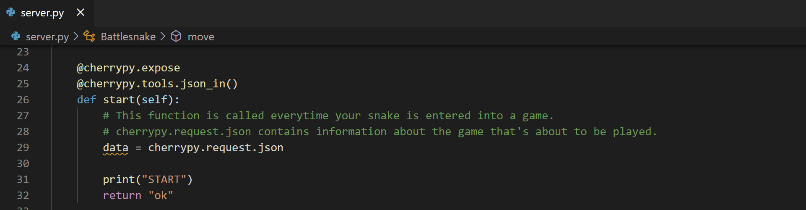

# schmelto-[Battlesnake](http://play.battlesnake.com) written in Python

This is my implementation of the [Battlesnake API](https://docs.battlesnake.com/references/api).

### Technologies Used

* [Python3](https://www.python.org/)
* [CherryPy](https://cherrypy.org/)


## Prerequisites

* [Visual Studio Code](https://code.visualstudio.com/)
* [Battlesnake Account](https://play.battlesnake.com)
* [ngrok](https://marketplace.visualstudio.com/items?itemName=philnash.ngrok-for-vscode)
* [GitHub Account](https://github.com) (Optional)

## Running local in Visual Studio Code with ngrok

1. Install [Visual Studio Code](https://code.visualstudio.com/), [Python](https://www.python.org/) (with [cerrypy](https://cherrypy.org/)) and install [ngrok](https://marketplace.visualstudio.com/items?itemName=philnash.ngrok-for-vscode) for Visual Studio Code

2. In Visual Studio Code press `Strg` + `Shift` + `P` to start the command palette and enter `>ngrok: start`

3. Specify a Port (probably `8080`)



4. Copy the ngrok URL (this we have to use later should look like `https://124798972d41.ngrok.io/`)

5. Hit the `run` button your Battlesnake server will start and you should see the following:

    ```
    Starting Battlesnake Server...
    ENGINE Serving on http://0.0.0.0:8080
    ```

**At this point your Battlesnake is live and ready to enter games!**


## Registering Your Battlesnake and Creating Your First Game

1. Sign in to [play.battlesnake.com](https://play.battlesnake.com/login/).

2. Go [here to create a new Battlesnake](https://play.battlesnake.com/account/snakes/create/). Give it a meaningful name and complete the form using the URL for your Repl from above.

3. Once your Battlesnake has been saved you can [create a new game](https://play.battlesnake.com/account/games/create/) and add your Battlesnake to it. Type your Battlesnake's name into the search field and click "Add" to add it to the game. Then click "Create Game" to start the game.

4. You should see a brand new Battlesnake game with your Battlesnake in it! Yay! Press "Play" to start the game and watch how your Battlesnake behaves. By default your Battlesnake should move randomly around the board.

5. Optionally, watch your Repl logs while the game is running to see your Battlesnake receiving API calls and responding with its moves.

Repeat steps 3 and 4 every time you want to see how your Battlesnake behaves. It's common for Battlesnake developers to repeat these steps often as they make their Battlesnake smarter. You can also use the "Create Rematch" button to quickly start a new game using the same Battlesnakes and configuration.

**At this point you should have a registered Battlesnake and be able to create games!**


